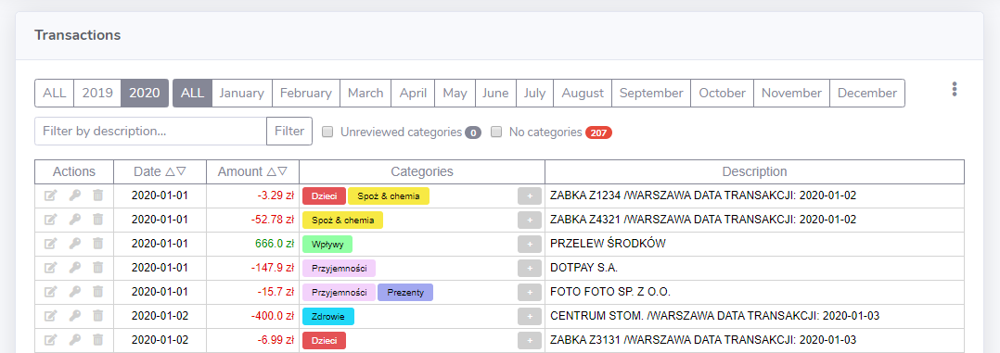

# Finance Scanner

**Finance Scanner** is a project that allows you to upload CSV files exported from a bank account in order to create a managable database with transactions. It also gives you the possibility to create diagrams and analyse expenses.

